# NexHR — Modern Employee Management System

<div align="center">


[](https://react.dev)
[](https://www.typescriptlang.org)
[](https://vitejs.dev)
[](https://tailwindcss.com)
[](https://www.framer.com/motion)
[](LICENSE)

**A flashy, modern HR platform with federated SSO authentication, real-time analytics, and full employee lifecycle management — built on the latest web stack.**

[Features](#-features) · [Architecture](#-architecture) · [Getting Started](#-getting-started) · [Usage Guide](#-usage-guide) · [Tech Stack](#-tech-stack)

</div>

---

## ✨ Features

| Module | Capabilities |
|--------|-------------|
| **🔐 Federated Auth** | Google, Microsoft & GitHub SSO — one-click sign-in, session persistence, enterprise domain lookup |
| **📊 Dashboard** | Live KPI cards, attendance trend charts, department distribution, top performers, recent hires |
| **👥 Employees** | Grid & list views, fuzzy search, multi-filter, add/edit/delete, full profile modal with skill tags |
| **🏢 Departments** | Per-department budget, headcount, avg salary, performance scores, team member roster |
| **📅 Attendance** | Interactive calendar, daily records table, status tracking (present/remote/late/absent/half-day) |
| **📈 Analytics** | Radar competency profiles, hiring vs attrition trends, salary vs performance scatter plots |
| **🔔 Notifications** | Real-time notification center with read/unread state, per-item dismiss |
| **⚙️ Settings** | Profile management, security/SSO info, notification preferences, session controls |

---

## 🏗 Architecture

### System Overview

```mermaid
graph TB
    subgraph Browser["🌐 Browser"]
        subgraph AuthLayer["Authentication Layer"]
            FedAuth["Federated SSO\n(Google / Microsoft / GitHub)"]
            Session["Session Store\n(localStorage)"]
            FedAuth -->|"JWT / Session Token"| Session
        end

        subgraph AppShell["Application Shell"]
            Router["React Router v6\n(Protected Routes)"]
            Layout["AppLayout\n(Sidebar + Header)"]
            Router --> Layout
        end

        subgraph Pages["Pages / Views"]
            Dashboard["📊 Dashboard"]
            Employees["👥 Employees"]
            Departments["🏢 Departments"]
            Attendance["📅 Attendance"]
            Analytics["📈 Analytics"]
            Notifications["🔔 Notifications"]
            Settings["⚙️ Settings"]
        end

        subgraph StateLayer["State Management"]
            AuthCtx["AuthContext\n(React Context)"]
            EmpStore["Employee Store\n(Zustand)"]
        end

        subgraph DataLayer["Data Layer"]
            MockData["Mock Data\n(TypeScript fixtures)"]
            MockData --> EmpStore
        end

        Session --> AuthCtx
        AuthCtx --> Router
        Layout --> Pages
        EmpStore --> Pages
    end

    style Browser fill:#0f0f23,color:#f1f5f9,stroke:#6366f1
    style AuthLayer fill:#1a1a35,color:#f1f5f9,stroke:#a855f7
    style AppShell fill:#1a1a35,color:#f1f5f9,stroke:#6366f1
    style Pages fill:#1a1a35,color:#f1f5f9,stroke:#06b6d4
    style StateLayer fill:#1a1a35,color:#f1f5f9,stroke:#10b981
    style DataLayer fill:#1a1a35,color:#f1f5f9,stroke:#f59e0b
```



---

### Component Tree

```mermaid
graph TD
    App["⚡ App.tsx\n(BrowserRouter + AuthProvider)"]

    App --> LoginPage["🔐 Login\n/login"]
    App --> AppLayout["🖼 AppLayout\n/ (protected)"]

    AppLayout --> Sidebar["◀ Sidebar\n(nav + user profile)"]
    AppLayout --> Header["▲ Header\n(search + notifications + avatar)"]
    AppLayout --> Outlet["📄 Page Outlet"]

    Outlet --> DashboardPage["📊 Dashboard\n/dashboard"]
    Outlet --> EmployeesPage["👥 Employees\n/employees"]
    Outlet --> DeptPage["🏢 Departments\n/departments"]
    Outlet --> AttPage["📅 Attendance\n/attendance"]
    Outlet --> AnalyticsPage["📈 Analytics\n/analytics"]
    Outlet --> NotifsPage["🔔 Notifications\n/notifications"]
    Outlet --> SettingsPage["⚙️ Settings\n/settings"]

    EmployeesPage --> EmployeeForm["📝 EmployeeForm\n(add/edit modal)"]
    EmployeesPage --> EmployeeProfile["👤 EmployeeProfile\n(view modal)"]

    DashboardPage --> Charts1["Recharts\nAreaChart · PieChart · BarChart"]
    AnalyticsPage --> Charts2["Recharts\nRadarChart · ComposedChart · ScatterChart"]

    style App fill:#6366f1,color:#fff,stroke:#4f46e5
    style AppLayout fill:#1e1b4b,color:#c7d2fe,stroke:#6366f1
    style LoginPage fill:#7c3aed,color:#fff,stroke:#6d28d9
```



---

### Authentication Flow


---

### Data & State Flow


---

### Folder Structure

```
EmpAttendance/
├── index.html                    # HTML entry point (Google Fonts CDN)
├── vite.config.ts                # Vite + React plugin config
├── tailwind.config.js            # Custom theme: dark palette, neon colours, animations
├── tsconfig.json                 # TypeScript strict config
│
├── public/
│   └── favicon.svg               # Gradient purple SVG icon
│
└── src/
    ├── main.tsx                  # React 18 createRoot entry
    ├── App.tsx                   # BrowserRouter + route definitions
    ├── index.css                 # Tailwind base + custom component classes
    │
    ├── types/
    │   └── index.ts              # Shared TypeScript interfaces (Employee, Dept, Attendance…)
    │
    ├── contexts/
    │   └── AuthContext.tsx       # Federated auth state (login / logout / session restore)
    │
    ├── store/
    │   └── employeeStore.ts      # Zustand store: CRUD + search/filter/sort logic
    │
    ├── data/
    │   └── mockData.ts           # 12 employees, 7 depts, 10 attendance records, chart data
    │
    ├── components/
    │   ├── Layout/
    │   │   ├── AppLayout.tsx     # Root layout shell
    │   │   ├── Sidebar.tsx       # Collapsible nav sidebar with active indicators
    │   │   └── Header.tsx        # Search bar, notification bell, user avatar menu
    │   │
    │   └── Employees/
    │       ├── EmployeeForm.tsx  # Add / edit employee modal (controlled form)
    │       └── EmployeeProfile.tsx # Read-only profile modal with metrics
    │
    └── pages/
        ├── Login.tsx             # Full-screen SSO login page
        ├── Dashboard.tsx         # KPI cards + 4 Recharts visualisations
        ├── Employees.tsx         # Filterable grid/list with CRUD modals
        ├── Departments.tsx       # Department cards with team stats
        ├── Attendance.tsx        # Calendar + daily attendance table
        ├── Analytics.tsx         # Advanced workforce analytics charts
        ├── Notifications.tsx     # Notification centre with read/delete
        └── Settings.tsx          # Profile, security, notification prefs
```

---

## 🚀 Getting Started

### Prerequisites

- **Node.js** ≥ 18.x
- **npm** ≥ 9.x

### Installation

```bash
# 1. Clone the repository
git clone https://github.com/MisterFantastic/EmpAttendance.git
cd EmpAttendance

# 2. Install dependencies
npm install

# 3. Start the development server
npm run dev
```

The app will be available at **http://localhost:5173**

### Other Scripts

```bash
npm run build     # Production build → dist/
npm run preview   # Serve the production build locally
npm run lint      # Run ESLint across all TypeScript files
```

---

## 📖 Usage Guide

### 1. Sign In

```mermaid
flowchart LR
    A["Open app\nlocalhost:5173"] --> B{"Logged in?"}
    B -- No --> C["🔐 Login Page"]
    B -- Yes --> G["📊 Dashboard"]
    C --> D["Click provider button\nGoogle · Microsoft · GitHub"]
    D --> E["Animated auth flow\n~1.8 seconds"]
    E --> G
```



On the login screen, choose any of the three federated identity providers. Each maps to a different demo user:

| Provider | Demo User | Role |
|----------|-----------|------|
| **Google** | Alex Johnson | Admin |
| **Microsoft** | Sam Taylor | HR Manager |
| **GitHub** | Jordan Lee | Department Manager |

Your session is automatically saved to `localStorage` and restored on page reload.

---

### 2. Navigating the App

```mermaid
flowchart TD
    Nav["◀ Sidebar Navigation"]

    Nav --> D["📊 Dashboard\nOverview of all KPIs"]
    Nav --> E["👥 Employees\nManage your workforce"]
    Nav --> Dp["🏢 Departments\nTeam structure & budgets"]
    Nav --> A["📅 Attendance\nDaily tracking & calendar"]
    Nav --> An["📈 Analytics\nDeep workforce insights"]
    Nav --> N["🔔 Notifications\nAlerts & reminders"]
    Nav --> S["⚙️ Settings\nAccount preferences"]

    Note["💡 Click the ◀ ▶ toggle\nto collapse the sidebar\nfor more screen space"]
```



The sidebar can be **collapsed** by clicking the toggle button on its right edge — useful on smaller screens.

---

### 3. Managing Employees

```mermaid
flowchart TD
    EmpPage["👥 Employees Page"]

    EmpPage --> Search["🔍 Search\nby name / email / role"]
    EmpPage --> Filter["🔽 Filter\nby Department or Status"]
    EmpPage --> Toggle["⊞ ⊟ Toggle\nGrid view ↔ List view"]

    EmpPage --> AddBtn["＋ Add Employee"]
    AddBtn --> Form["📝 Fill in the form\n(name, email, dept, salary…)"]
    Form --> Save["💾 Save → appears in list instantly"]

    EmpPage --> CardClick["Click any employee card"]
    CardClick --> Profile["👤 Profile Modal\n(full details + performance bars)"]
    Profile --> EditBtn["✏️ Edit button"]
    EditBtn --> Form

    EmpPage --> HoverCard["Hover a card"]
    HoverCard --> Actions["✏️ Edit  🗑 Delete icons appear"]
```



**Adding a skill tag:** In the employee form, type a skill name and press **Enter** or click **Add**. Skills appear as removable purple tags.

---

### 4. Reading the Dashboard

```mermaid
graph LR
    subgraph Top["Top Row — KPI Cards"]
        K1["👥 Total Employees"]
        K2["✅ Active Today"]
        K3["📈 Avg Performance"]
        K4["💰 Avg Salary"]
    end

    subgraph Mid["Middle Row — Charts"]
        C1["📉 Attendance Trend\n7-day area chart\nPresent / Remote / Absent"]
        C2["🥧 Department Pie\nHeadcount by team"]
    end

    subgraph Bot["Bottom Row — Insights"]
        B1["📊 Salary by Dept\nBar chart avg salary"]
        B2["⭐ Top Performers\nRanked by performance %"]
        B3["🆕 Recent Hires\nLatest additions"]
    end
```



---

### 5. Attendance Tracking

```mermaid
flowchart LR
    Cal["📅 Calendar\n(left panel)"]
    Cal -->|"Click a date"| Records["📋 Daily Records Table\n(right panel)"]
    Records --> Status["Status badges:\n✅ Present\n🌐 Remote\n⏰ Late\n❌ Absent\n⏳ Half-day"]
    Records --> Times["Check-in / Check-out times\n+ Total hours worked"]

    Cal -->|"Purple dot"| HasData["Date has data"]
    Cal -->|"Purple ring"| Today["Today (Feb 19)"]
```



---

### 6. Analytics Deep Dive

| Chart | What it shows |
|-------|---------------|
| **Team Competency Radar** | Average scores across 6 dimensions: Productivity, Attendance, Performance, Collaboration, Innovation, Leadership |
| **Hiring vs Attrition** | Monthly hired/left bars + net headcount trend line (last 7 months) |
| **Salary vs Performance Scatter** | Each dot = one employee; reveals whether top performers are fairly compensated |

---

### 7. Signing Out

Click your **avatar** in the top-right corner → **Sign out** — or navigate to **Settings** and click the red **Sign Out** button. Your session is immediately cleared.

---

## 🛠 Tech Stack

| Category | Technology | Purpose |
|----------|-----------|---------|
| **Bundler** | [Vite 5](https://vitejs.dev) | Lightning-fast HMR dev server + optimised production builds |
| **UI Framework** | [React 18](https://react.dev) | Component model, concurrent features |
| **Language** | [TypeScript 5](https://www.typescriptlang.org) | Full type safety across the codebase |
| **Styling** | [TailwindCSS 3](https://tailwindcss.com) | Utility-first CSS with custom dark palette & animations |
| **Animation** | [Framer Motion 10](https://www.framer.com/motion) | Page transitions, card entrances, modal springs |
| **Charts** | [Recharts 2](https://recharts.org) | Area, bar, pie, radar, composed, scatter charts |
| **State** | [Zustand 4](https://zustand-demo.pmnd.rs) | Lightweight global store for employee CRUD + filters |
| **Routing** | [React Router 6](https://reactrouter.com) | Nested protected/public routes |
| **Dates** | [date-fns 2](https://date-fns.org) | Calendar generation, date formatting |
| **Icons** | [Lucide React](https://lucide.dev) | Consistent, tree-shaken SVG icon set |
| **Auth** | Federated SSO (mocked) | Google / Microsoft / GitHub OAuth 2.0 / OIDC flow |

### Design System

The UI is built around a **dark glassmorphism** theme:

- **Background**: deep navy `#0a0a1a` with radial glow blobs
- **Cards**: `bg-white/5 backdrop-blur-md` — frosted glass panels
- **Primary**: Purple → Indigo gradient (`#a855f7 → #6366f1`)
- **Accents**: Neon cyan `#06b6d4`, Emerald `#10b981`, Pink `#ec4899`
- **Typography**: Inter (body) + Space Grotesk (headings)
- **Animations**: Spring-based modals, staggered card entrances, glow pulses

---

## 🔒 Security Notes

- Authentication is **federated** — no passwords are stored locally
- Sessions are managed by the upstream identity provider (Google / Microsoft / GitHub)
- The current implementation uses a **mock OAuth flow** for demonstration; replace `AuthContext.tsx`'s `login()` function with a real SDK (Auth0, Firebase Auth, Azure MSAL, etc.) for production
- All session state is held in `localStorage` under the key `nexhr_user`

---

## 🗺 Roadmap

- [ ] Real OAuth 2.0 integration (Auth0 / Firebase)
- [ ] REST API / Supabase backend for persistent data
- [ ] Role-based access control (admin vs HR vs manager views)
- [ ] Leave request workflow with approval chain
- [ ] Export to CSV / PDF reports
- [ ] Dark / light theme toggle
- [ ] Mobile-responsive sidebar drawer
- [ ] Internationalisation (i18n)

---

## 📄 License

MIT © 2026 NexHR

---

<div align="center">
  Built with ❤️ using React 18 · Vite · TailwindCSS · Framer Motion
</div>
